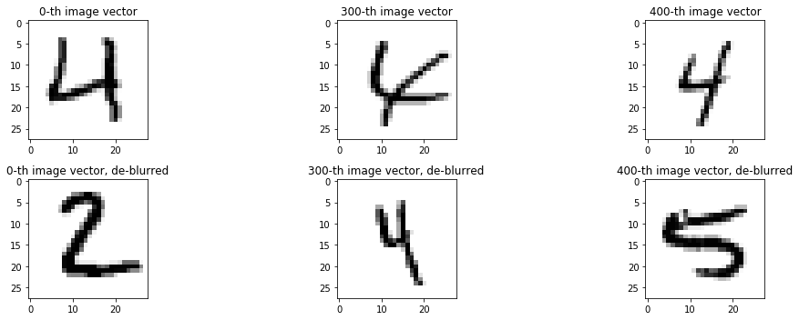

  <script type="text/x-mathjax-config">
    MathJax.Hub.Config({
      tex2jax: {
        skipTags: ['script', 'noscript', 'style', 'textarea', 'pre'],
        inlineMath: [['$','$']]
      }
    });
  </script>
  <script src="https://cdn.mathjax.org/mathjax/latest/MathJax.js?config=TeX-AMS-MML_HTMLorMML" type="text/javascript"></script>

# HW4: Practical to Neural Networks

**Due date**: Wed. July 10 at 11:59PM EST.

**Turn-in links**:

IMPORTANT: please name the file as firstname_lastname.ipynb

* JUPYTER notebook turned in to: <https://www.aeoncase.com/inbox/AA2YItDVwwJUdt4H1FYkM>


**Files to Turn In:**

Access the following colab link and complete the exercises. Then, reach `File` in the menu
and select `Download .ipynb`. Save the file and turn the file in the link above.

* [Colab link](https://colab.research.google.com/drive/17NvzY3vXxgs24GqgwSVHXELa1GhqBo-b)
* COLLABORATORS : complete the cell with your name and the name of your collaborator inside the notebook.

PDF report: no pdf report is needed for this homework.

* This document will be manually graded

Note: be sure that all plots include readable axes, labels and legends if needed, when multiple lines are shown.


---


#### Import libraries


```python
#import libraries for implementing neural networks
import keras
from keras.models import Sequential
from keras.layers import Dense
from keras.optimizers import SGD, Adam
from keras.datasets import mnist
#import sklearn packages
from sklearn.datasets import make_moons, make_circles
from sklearn.preprocessing import scale, PolynomialFeatures
from sklearn.model_selection import train_test_split
from sklearn.linear_model import LogisticRegression
from sklearn.pipeline import make_pipeline
from sklearn.metrics import confusion_matrix
from sklearn.metrics import accuracy_score
#import libraries of data manipulation, matrix operations and visualization
import pandas as pd
import numpy as np
import matplotlib.pyplot as plt
%matplotlib inline
```


## Application: Handwritten Digit Classification

A common image processing task is to convert hand written documents into digital ones so that information can be extracted and stored in a database. However, written text can vary widely in shape and size (depending on the individual who is writting). Recognizing the letter  6 regardless, for example, across different styles of writting is very difficult.

In this problem, your task is to classify images of handwritten digits.

The data set is provided in the file `dataset_1.txt` and contains 28x28 gray-scale images of hand-written digits, flattened to a $784$-length vector. The last column contains the digit. For simplicity, we have only included digits 2, 4, 5.

We want you to build a model that can be given the image of a hand-written digit and correctly classify this digit as 2, 4, 5.

#### Loading the data


```python
# load the hand-written digits dataset
(digits_train, labels_train), (digits_test, labels_test) = mnist.load_data()

# make training data set with only 2, 4, 5
train_mask = (labels_train == 2) | (labels_train == 4) | (labels_train == 5)
test_mask = (labels_test == 2) | (labels_test == 4) | (labels_test == 5)
X_train = digits_train[train_mask].reshape((-1, 784))
Y_train = labels_train[train_mask]
# make testing data set
X_test = digits_test[test_mask].reshape((-1, 784))
Y_test = labels_test[test_mask]

# subsample from training data
train_subsample = np.random.choice(len(X_train), 5000, replace=False)
X_train = X_train[train_subsample]
Y_train = Y_train[train_subsample]
```

#### Check the shapes of the datasets


```python
print('X_train shape:', X_train.shape)
print('X_test shape:', X_test.shape)
```

    X_train shape: (5000, 784)
    X_test shape: (3195, 784)


#### Plot a couple of images from the training set

Remember that since each 28x28 image has been flattened to a 784-long vector, we need to reshape each image back into 28x28 when we visualize the images.


```python
# Plot a couple of images from the dataset
image_shape = (28, 28)
fig, ax = plt.subplots(2, 3, figsize=(15, 5))
# images from training data
ax[0, 0].imshow(X_train[0].reshape(image_shape), cmap=plt.cm.gray_r)
ax[0, 0].set_title('0-th image vector')
ax[0, 1].imshow(X_train[300].reshape(image_shape), cmap=plt.cm.gray_r)
ax[0, 1].set_title('300-th image vector')
ax[0, 2].imshow(X_train[400].reshape(image_shape), cmap=plt.cm.gray_r)
ax[0, 2].set_title('400-th image vector')

# images from testing data
ax[1, 0].imshow(X_test[0].reshape(image_shape), cmap=plt.cm.gray_r, interpolation='nearest')
ax[1, 0].set_title('0-th image vector, de-blurred')
ax[1, 1].imshow(X_test[300].reshape(image_shape), cmap=plt.cm.gray_r, interpolation='nearest')
ax[1, 1].set_title('300-th image vector, de-blurred')
ax[1, 2].imshow(X_test[400].reshape(image_shape), cmap=plt.cm.gray_r, interpolation='nearest')
ax[1, 2].set_title('400-th image vector, de-blurred')

plt.tight_layout()
plt.show()
```





## Exercise 1: Build a Logistic Regression model to classify handwritten digits.


#### Part A. Fit a logistic regression with linear boundary to the training data set

Note that since there are 3 classes, you need to let `sklearn`'s logistic regression know that you are performing multiclass classification. Do this by setting the `multi_class` parameter, for example:
``` python
sklearn.linear_model.LogisticRegression(C=1., multi_class='multinomial')
```


```python
# WRITE CODE
```

#### Part B.  Evaluate your classifier using accuracy and confusion matrices.

Print the confusion matrix and accuracy of your classifier.


```python
# WRITE CODE
```

Does your classifiers fit each class equally well? Why or why not (use your understanding of the data to determine why certain classes are harder to classify)?

**Answer**: COMPLETE

## Exercise 2: Build a neural network model to classify handwritten digits.


#### Part A. Fit a neural network with your choice of architecture and activation to the training data set

Note that since there are 3 classes, you need to let `keras` neural network model know that you are performing multiclass classification. Do this by setting the number of output nodes in the output layer to be 3 and the activation in the output layer to be `softmax`. For example,
``` python
model.add(Dense(3, activation='softmax'))
```
You also need to set the loss function to be `categorical_crossentropy`. In particular:
``` python
model.compile(loss='categorical_crossentropy', optimizer=adam)
```


```python
# WRITE CODE
```

#### Part B.  Evaluate your classifier using accuracy and confusion matrices.

Print the confusion matrix and accuracy of your classifier.


```python
# WRITE CODE
```


Does your classifiers fit each class equally well? Why or why not (use your understanding of the data to determine why certain classes are harder to classify)?


**Answer**: COMPLETE


#### Part C.  Compare your neural network classifier to your logistic regression classifier.

Which model performs best on this dataset and this task? Why do you think that is?

**Answer**: COMPLETE


```python

```
