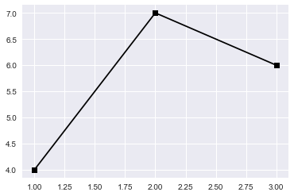
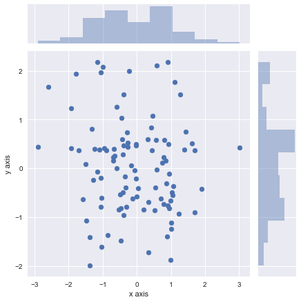
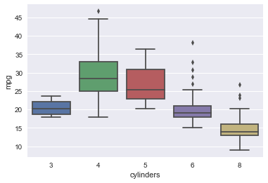
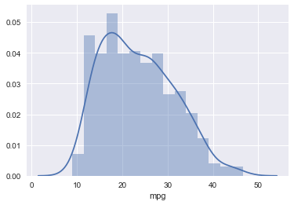
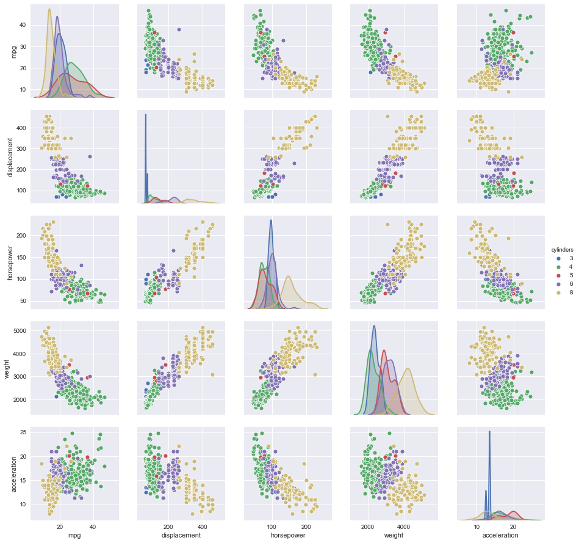

# Introduction to NumPy : Arrays, Plotting, and Data Management

A Python-based version of the "Ch 2 lab" from "Introduction to Statistical Learning"

Based on a notebook:
https://nbviewer.jupyter.org/github/emredjan/ISL-python/blob/master/labs/lab_02.3_introduction.ipynb

# 2.3.1 Basic Commands


```python
# imports and setup
import numpy as np

import seaborn as sns
import matplotlib
import matplotlib.pyplot as plt

import math

import pandas as pd

%matplotlib inline
np.set_printoptions(suppress=True, precision=2)
pd.set_option('precision', 2) # number precision for pandas
plt.style.use('seaborn') # pretty matplotlib plots
```

# Show basic line plot


```python
plt.plot([1, 2, 3], [4, 7, 6], 'ks-');
```





# Show writing math via LaTeX syntax

$$
a^2 + b^3 = \sqrt{c^2}
$$

$$
p(y | x) = \frac{ p(x | y) p(y) }{ p(x) }
$$

# Basic array creation and manipulation


```python
x = np.array([1.0, 6, 2]);
print(x);
len(x)
```

    [1. 6. 2.]


    3


```python
y = np.array([1.0, 4, 3])
print(y)
```

    [1. 4. 3.]


```python
# array operations
x + y
```


    array([ 2., 10.,  5.])


```python
x - y 
```


    array([ 0.,  2., -1.])


```python
x / y
```


    array([1.  , 1.5 , 0.67])


# 2D NumPy arrays


```python
# Create 2D array 'M'
M = np.asarray([[1, 4, 7], [2, 5, 8], [3, 6, 9]])
M
```


    array([[1, 4, 7],
           [2, 5, 8],
           [3, 6, 9]])


```python
M.dtype
```


    dtype('int64')


```python
# Create 2D array 'M' as floats
M = np.asarray([[1, 4, 7.0], [2, 5, 8], [3, 6, 9]])
M
```


    array([[1., 4., 7.],
           [2., 5., 8.],
           [3., 6., 9.]])


```python
M.dtype
```


    dtype('float64')


# Transforms from 1D to 2D


```python
y = np.array([1.0, 4, 3])
y
```


    array([1., 4., 3.])


```python
y[np.newaxis,:]
```


    array([[1., 4., 3.]])


```python
y[:,np.newaxis]
```


    array([[1.],
           [4.],
           [3.]])


# Different kinds of multiplication

### Element-wise multiplication: (M, N) times (M, N) yields an (M,N) array


```python
M * M
```


    array([[ 1., 16., 49.],
           [ 4., 25., 64.],
           [ 9., 36., 81.]])


### Element-wise multiply with broadcast: (M, N) times (N) yields an (M,N) array

Here y is implicitly expanded to (1,3) and thus multiplied element-wise to each row


```python
y
```


    array([1., 4., 3.])


```python
M * y
```


    array([[ 1., 16., 21.],
           [ 2., 20., 24.],
           [ 3., 24., 27.]])


Here y is multiplied element-wise at each column


```python
M * y[:,np.newaxis]
```


    array([[ 1.,  4.,  7.],
           [ 8., 20., 32.],
           [ 9., 18., 27.]])


### Matrix-vector product: (M, N) times (N,) yields (M,)


```python
np.dot(M, y)
```


    array([38., 46., 54.])


## Pro tip: NumPy has a 'matrix' type, but you won't need it!


```python
# matrix creation
Mmat = np.asmatrix(M)
Mmat
```


    matrix([[1., 4., 7.],
            [2., 5., 8.],
            [3., 6., 9.]])


# Random number generation


```python
# random normal distribution & correlation
x = np.random.normal(size=50)
x
```


    array([-0.74,  0.24, -3.16, -0.91,  1.56, -0.59,  1.57,  1.74, -1.02,
           -0.32, -0.78,  0.32,  1.23, -2.82,  1.2 , -0.25, -0.06, -0.86,
            0.23,  0.41,  0.89, -0.2 , -0.16, -0.01, -0.83, -0.27,  0.4 ,
           -1.08,  1.04,  0.49, -1.11,  0.73, -0.27, -1.26, -1.3 , -2.63,
            0.22, -0.68, -2.23, -0.34, -0.45, -0.27, -0.57, -0.43,  0.81,
           -0.9 ,  0.52,  2.9 ,  2.16,  0.17])


```python
y = x + np.random.normal(loc=50, scale=.1, size=50)
y
```


    array([49.22, 50.17, 46.86, 49.16, 51.65, 49.39, 51.54, 51.88, 48.91,
           49.6 , 49.17, 50.24, 51.19, 47.21, 51.12, 49.74, 49.84, 49.15,
           50.36, 50.47, 51.01, 49.77, 49.63, 49.99, 49.12, 49.69, 50.4 ,
           48.79, 51.02, 50.53, 48.79, 50.78, 49.72, 48.85, 48.7 , 47.49,
           50.22, 49.24, 47.89, 49.56, 49.59, 49.61, 49.3 , 49.76, 50.93,
           49.16, 50.63, 52.86, 52.03, 50.2 ])


```python
# random seed
np.random.seed(3)
y = np.random.normal(size=20)
y
```


    array([ 1.79,  0.44,  0.1 , -1.86, -0.28, -0.35, -0.08, -0.63, -0.04,
           -0.48, -1.31,  0.88,  0.88,  1.71,  0.05, -0.4 , -0.55, -1.55,
            0.98, -1.1 ])


```python
# random seed
np.random.seed(3)
y = np.random.normal(size=20)
y
```


    array([ 1.79,  0.44,  0.1 , -1.86, -0.28, -0.35, -0.08, -0.63, -0.04,
           -0.48, -1.31,  0.88,  0.88,  1.71,  0.05, -0.4 , -0.55, -1.55,
            0.98, -1.1 ])


```python
# random seed
np.random.seed(30)
y = np.random.normal(size=20)
y
```


    array([-1.26,  1.53, -0.97,  0.47, -0.1 ,  0.3 , -1.73,  1.59,  0.13,
           -1.11,  1.58,  0.11, -0.76, -0.78,  1.38,  0.76, -0.29,  0.54,
           -2.08,  0.94])


# 2.3.2 Graphics


```python
x = np.random.normal(size=100)
y = np.random.normal(size=100)

# seaborn scatterplot
p = sns.jointplot(x, y, kind='scatter')
p.set_axis_labels(xlabel='x axis', ylabel='y axis');
```

    /Users/mhughes/anaconda2/envs/comp135_env/lib/python3.6/site-packages/scipy/stats/stats.py:1706: FutureWarning: Using a non-tuple sequence for multidimensional indexing is deprecated; use `arr[tuple(seq)]` instead of `arr[seq]`. In the future this will be interpreted as an array index, `arr[np.array(seq)]`, which will result either in an error or a different result.
      return np.add.reduce(sorted[indexer] * weights, axis=axis) / sumval





```python
# create a sequence of numbers
x = np.arange(1, 11)
x
```


    array([ 1,  2,  3,  4,  5,  6,  7,  8,  9, 10])


```python
# linearly spaced numbers
x = np.linspace(-np.pi, np.pi, num=50)
x
```


    array([-3.14, -3.01, -2.89, -2.76, -2.63, -2.5 , -2.37, -2.24, -2.12,
           -1.99, -1.86, -1.73, -1.6 , -1.47, -1.35, -1.22, -1.09, -0.96,
           -0.83, -0.71, -0.58, -0.45, -0.32, -0.19, -0.06,  0.06,  0.19,
            0.32,  0.45,  0.58,  0.71,  0.83,  0.96,  1.09,  1.22,  1.35,
            1.47,  1.6 ,  1.73,  1.86,  1.99,  2.12,  2.24,  2.37,  2.5 ,
            2.63,  2.76,  2.89,  3.01,  3.14])


# 2.3.3 Indexing Data


```python
# 2D array creation
# R equivalent of matrix(1:16, 4 ,4))
A = np.arange(1, 17).reshape(4, 4).transpose()
A
```


    array([[ 1,  5,  9, 13],
           [ 2,  6, 10, 14],
           [ 3,  7, 11, 15],
           [ 4,  8, 12, 16]])


```python
# Show the first row
A[0]
```


    array([ 1,  5,  9, 13])


```python
# Grab the second row, third column
A[1,2]
```


    10


```python
# select a range of rows and columns
A[0:3, 1:4]
```


    array([[ 5,  9, 13],
           [ 6, 10, 14],
           [ 7, 11, 15]])


```python
# select a range of rows and all columns
A[0:2,:]
```


    array([[ 1,  5,  9, 13],
           [ 2,  6, 10, 14]])


```python
# select all rows and a range of columns
A[:,0:2]
```


    array([[1, 5],
           [2, 6],
           [3, 7],
           [4, 8]])


```python
# select the *last* row
A[-1]
```


    array([ 4,  8, 12, 16])


```python
A[-2]
```


    array([ 3,  7, 11, 15])


```python
# shape of the array
A.shape
```


    (4, 4)


```python
# N : num of example
# F : num of features or measurements
```


```python
N = 10000
F = 30
x_NF = np.random.randn(N, F)
y_NF = np.random.randn(N, F)
```


```python
np.dot( x_NF, y_NF.T)
```


    ---------------------------------------------------------------------------

    KeyboardInterrupt                         Traceback (most recent call last)

    <ipython-input-36-6ccfc1442f1d> in <module>
    ----> 1 np.dot( x_NF, y_NF.T)
    

    KeyboardInterrupt: 


# 2.3.4 Loading Data

# Show first 5 lines of raw "comma-separated value" file


```python
with open('datasets/Auto.csv', 'r') as f:
    for line in f.readlines()[:5]:
        print(line.strip())
```

    mpg,cylinders,displacement,horsepower,weight,acceleration,year,origin,name
    18,8,307,130,3504,12,70,1,chevrolet chevelle malibu
    15,8,350,165,3693,11.5,70,1,buick skylark 320
    18,8,318,150,3436,11,70,1,plymouth satellite
    16,8,304,150,3433,12,70,1,amc rebel sst


```python
auto_arr = np.loadtxt('datasets/Auto.csv', delimiter=',', skiprows=1, dtype=str)
```


```python
auto_arr.shape
```


    (397, 9)


```python
auto_arr[0]
```


    array(['18', '8', '307', '130', '3504', '12', '70', '1',
           'chevrolet chevelle malibu'], dtype='<U36')


```python
try:
    auto_num_arr = np.asarray(auto_arr[:,:-1], dtype=np.float64)
except Exception as e:
    print(str(type(e)) + ': ' + str(e))
```

    <class 'ValueError'>: could not convert string to float: '?'


## Tricky part: Need to replace missing value '?' strings with np.nan


```python
auto_num_arr = auto_arr[:,:-1].copy()
auto_num_arr[auto_num_arr == '?'] = np.nan
```


```python
auto_num_arr = np.asarray(auto_num_arr, dtype=np.float64)
```


```python
np.mean(auto_num_arr, axis=0)
```


    array([  23.52,    5.46,  193.53,     nan, 2970.26,   15.56,   75.99,
              1.57])


```python
np.nanmean(auto_num_arr, axis=0)
```


    array([  23.52,    5.46,  193.53,  104.47, 2970.26,   15.56,   75.99,
              1.57])


```python
np.nanmin(auto_num_arr, axis=0)
```


    array([   9.,    3.,   68.,   46., 1613.,    8.,   70.,    1.])


```python
np.nanmax(auto_num_arr, axis=0)
```


    array([  46.6,    8. ,  455. ,  230. , 5140. ,   24.8,   82. ,    3. ])


# Alternative: Read as pandas DataFrame obj


```python
# read csv data with pandas into dataframe, explicitly setting na_values.
# pandas read_xxx functions infer datatypes, headers, dates, etc. 
# without explicit daeclarations
Auto = pd.read_csv('datasets/Auto.csv', na_values=['?'])
Auto
```


<div>
<style scoped>
    .dataframe tbody tr th:only-of-type {
        vertical-align: middle;
    }

    .dataframe tbody tr th {
        vertical-align: top;
    }

    .dataframe thead th {
        text-align: right;
    }
</style>
<table border="1" class="dataframe">
  <thead>
    <tr style="text-align: right;">
      <th></th>
      <th>mpg</th>
      <th>cylinders</th>
      <th>displacement</th>
      <th>horsepower</th>
      <th>weight</th>
      <th>acceleration</th>
      <th>year</th>
      <th>origin</th>
      <th>name</th>
    </tr>
  </thead>
  <tbody>
    <tr>
      <th>0</th>
      <td>18.0</td>
      <td>8</td>
      <td>307.0</td>
      <td>130.0</td>
      <td>3504</td>
      <td>12.0</td>
      <td>70</td>
      <td>1</td>
      <td>chevrolet chevelle malibu</td>
    </tr>
    <tr>
      <th>1</th>
      <td>15.0</td>
      <td>8</td>
      <td>350.0</td>
      <td>165.0</td>
      <td>3693</td>
      <td>11.5</td>
      <td>70</td>
      <td>1</td>
      <td>buick skylark 320</td>
    </tr>
    <tr>
      <th>2</th>
      <td>18.0</td>
      <td>8</td>
      <td>318.0</td>
      <td>150.0</td>
      <td>3436</td>
      <td>11.0</td>
      <td>70</td>
      <td>1</td>
      <td>plymouth satellite</td>
    </tr>
    <tr>
      <th>3</th>
      <td>16.0</td>
      <td>8</td>
      <td>304.0</td>
      <td>150.0</td>
      <td>3433</td>
      <td>12.0</td>
      <td>70</td>
      <td>1</td>
      <td>amc rebel sst</td>
    </tr>
    <tr>
      <th>4</th>
      <td>17.0</td>
      <td>8</td>
      <td>302.0</td>
      <td>140.0</td>
      <td>3449</td>
      <td>10.5</td>
      <td>70</td>
      <td>1</td>
      <td>ford torino</td>
    </tr>
    <tr>
      <th>5</th>
      <td>15.0</td>
      <td>8</td>
      <td>429.0</td>
      <td>198.0</td>
      <td>4341</td>
      <td>10.0</td>
      <td>70</td>
      <td>1</td>
      <td>ford galaxie 500</td>
    </tr>
    <tr>
      <th>6</th>
      <td>14.0</td>
      <td>8</td>
      <td>454.0</td>
      <td>220.0</td>
      <td>4354</td>
      <td>9.0</td>
      <td>70</td>
      <td>1</td>
      <td>chevrolet impala</td>
    </tr>
    <tr>
      <th>7</th>
      <td>14.0</td>
      <td>8</td>
      <td>440.0</td>
      <td>215.0</td>
      <td>4312</td>
      <td>8.5</td>
      <td>70</td>
      <td>1</td>
      <td>plymouth fury iii</td>
    </tr>
    <tr>
      <th>8</th>
      <td>14.0</td>
      <td>8</td>
      <td>455.0</td>
      <td>225.0</td>
      <td>4425</td>
      <td>10.0</td>
      <td>70</td>
      <td>1</td>
      <td>pontiac catalina</td>
    </tr>
    <tr>
      <th>9</th>
      <td>15.0</td>
      <td>8</td>
      <td>390.0</td>
      <td>190.0</td>
      <td>3850</td>
      <td>8.5</td>
      <td>70</td>
      <td>1</td>
      <td>amc ambassador dpl</td>
    </tr>
    <tr>
      <th>10</th>
      <td>15.0</td>
      <td>8</td>
      <td>383.0</td>
      <td>170.0</td>
      <td>3563</td>
      <td>10.0</td>
      <td>70</td>
      <td>1</td>
      <td>dodge challenger se</td>
    </tr>
    <tr>
      <th>11</th>
      <td>14.0</td>
      <td>8</td>
      <td>340.0</td>
      <td>160.0</td>
      <td>3609</td>
      <td>8.0</td>
      <td>70</td>
      <td>1</td>
      <td>plymouth 'cuda 340</td>
    </tr>
    <tr>
      <th>12</th>
      <td>15.0</td>
      <td>8</td>
      <td>400.0</td>
      <td>150.0</td>
      <td>3761</td>
      <td>9.5</td>
      <td>70</td>
      <td>1</td>
      <td>chevrolet monte carlo</td>
    </tr>
    <tr>
      <th>13</th>
      <td>14.0</td>
      <td>8</td>
      <td>455.0</td>
      <td>225.0</td>
      <td>3086</td>
      <td>10.0</td>
      <td>70</td>
      <td>1</td>
      <td>buick estate wagon (sw)</td>
    </tr>
    <tr>
      <th>14</th>
      <td>24.0</td>
      <td>4</td>
      <td>113.0</td>
      <td>95.0</td>
      <td>2372</td>
      <td>15.0</td>
      <td>70</td>
      <td>3</td>
      <td>toyota corona mark ii</td>
    </tr>
    <tr>
      <th>15</th>
      <td>22.0</td>
      <td>6</td>
      <td>198.0</td>
      <td>95.0</td>
      <td>2833</td>
      <td>15.5</td>
      <td>70</td>
      <td>1</td>
      <td>plymouth duster</td>
    </tr>
    <tr>
      <th>16</th>
      <td>18.0</td>
      <td>6</td>
      <td>199.0</td>
      <td>97.0</td>
      <td>2774</td>
      <td>15.5</td>
      <td>70</td>
      <td>1</td>
      <td>amc hornet</td>
    </tr>
    <tr>
      <th>17</th>
      <td>21.0</td>
      <td>6</td>
      <td>200.0</td>
      <td>85.0</td>
      <td>2587</td>
      <td>16.0</td>
      <td>70</td>
      <td>1</td>
      <td>ford maverick</td>
    </tr>
    <tr>
      <th>18</th>
      <td>27.0</td>
      <td>4</td>
      <td>97.0</td>
      <td>88.0</td>
      <td>2130</td>
      <td>14.5</td>
      <td>70</td>
      <td>3</td>
      <td>datsun pl510</td>
    </tr>
    <tr>
      <th>19</th>
      <td>26.0</td>
      <td>4</td>
      <td>97.0</td>
      <td>46.0</td>
      <td>1835</td>
      <td>20.5</td>
      <td>70</td>
      <td>2</td>
      <td>volkswagen 1131 deluxe sedan</td>
    </tr>
    <tr>
      <th>20</th>
      <td>25.0</td>
      <td>4</td>
      <td>110.0</td>
      <td>87.0</td>
      <td>2672</td>
      <td>17.5</td>
      <td>70</td>
      <td>2</td>
      <td>peugeot 504</td>
    </tr>
    <tr>
      <th>21</th>
      <td>24.0</td>
      <td>4</td>
      <td>107.0</td>
      <td>90.0</td>
      <td>2430</td>
      <td>14.5</td>
      <td>70</td>
      <td>2</td>
      <td>audi 100 ls</td>
    </tr>
    <tr>
      <th>22</th>
      <td>25.0</td>
      <td>4</td>
      <td>104.0</td>
      <td>95.0</td>
      <td>2375</td>
      <td>17.5</td>
      <td>70</td>
      <td>2</td>
      <td>saab 99e</td>
    </tr>
    <tr>
      <th>23</th>
      <td>26.0</td>
      <td>4</td>
      <td>121.0</td>
      <td>113.0</td>
      <td>2234</td>
      <td>12.5</td>
      <td>70</td>
      <td>2</td>
      <td>bmw 2002</td>
    </tr>
    <tr>
      <th>24</th>
      <td>21.0</td>
      <td>6</td>
      <td>199.0</td>
      <td>90.0</td>
      <td>2648</td>
      <td>15.0</td>
      <td>70</td>
      <td>1</td>
      <td>amc gremlin</td>
    </tr>
    <tr>
      <th>25</th>
      <td>10.0</td>
      <td>8</td>
      <td>360.0</td>
      <td>215.0</td>
      <td>4615</td>
      <td>14.0</td>
      <td>70</td>
      <td>1</td>
      <td>ford f250</td>
    </tr>
    <tr>
      <th>26</th>
      <td>10.0</td>
      <td>8</td>
      <td>307.0</td>
      <td>200.0</td>
      <td>4376</td>
      <td>15.0</td>
      <td>70</td>
      <td>1</td>
      <td>chevy c20</td>
    </tr>
    <tr>
      <th>27</th>
      <td>11.0</td>
      <td>8</td>
      <td>318.0</td>
      <td>210.0</td>
      <td>4382</td>
      <td>13.5</td>
      <td>70</td>
      <td>1</td>
      <td>dodge d200</td>
    </tr>
    <tr>
      <th>28</th>
      <td>9.0</td>
      <td>8</td>
      <td>304.0</td>
      <td>193.0</td>
      <td>4732</td>
      <td>18.5</td>
      <td>70</td>
      <td>1</td>
      <td>hi 1200d</td>
    </tr>
    <tr>
      <th>29</th>
      <td>27.0</td>
      <td>4</td>
      <td>97.0</td>
      <td>88.0</td>
      <td>2130</td>
      <td>14.5</td>
      <td>71</td>
      <td>3</td>
      <td>datsun pl510</td>
    </tr>
    <tr>
      <th>...</th>
      <td>...</td>
      <td>...</td>
      <td>...</td>
      <td>...</td>
      <td>...</td>
      <td>...</td>
      <td>...</td>
      <td>...</td>
      <td>...</td>
    </tr>
    <tr>
      <th>367</th>
      <td>28.0</td>
      <td>4</td>
      <td>112.0</td>
      <td>88.0</td>
      <td>2605</td>
      <td>19.6</td>
      <td>82</td>
      <td>1</td>
      <td>chevrolet cavalier</td>
    </tr>
    <tr>
      <th>368</th>
      <td>27.0</td>
      <td>4</td>
      <td>112.0</td>
      <td>88.0</td>
      <td>2640</td>
      <td>18.6</td>
      <td>82</td>
      <td>1</td>
      <td>chevrolet cavalier wagon</td>
    </tr>
    <tr>
      <th>369</th>
      <td>34.0</td>
      <td>4</td>
      <td>112.0</td>
      <td>88.0</td>
      <td>2395</td>
      <td>18.0</td>
      <td>82</td>
      <td>1</td>
      <td>chevrolet cavalier 2-door</td>
    </tr>
    <tr>
      <th>370</th>
      <td>31.0</td>
      <td>4</td>
      <td>112.0</td>
      <td>85.0</td>
      <td>2575</td>
      <td>16.2</td>
      <td>82</td>
      <td>1</td>
      <td>pontiac j2000 se hatchback</td>
    </tr>
    <tr>
      <th>371</th>
      <td>29.0</td>
      <td>4</td>
      <td>135.0</td>
      <td>84.0</td>
      <td>2525</td>
      <td>16.0</td>
      <td>82</td>
      <td>1</td>
      <td>dodge aries se</td>
    </tr>
    <tr>
      <th>372</th>
      <td>27.0</td>
      <td>4</td>
      <td>151.0</td>
      <td>90.0</td>
      <td>2735</td>
      <td>18.0</td>
      <td>82</td>
      <td>1</td>
      <td>pontiac phoenix</td>
    </tr>
    <tr>
      <th>373</th>
      <td>24.0</td>
      <td>4</td>
      <td>140.0</td>
      <td>92.0</td>
      <td>2865</td>
      <td>16.4</td>
      <td>82</td>
      <td>1</td>
      <td>ford fairmont futura</td>
    </tr>
    <tr>
      <th>374</th>
      <td>36.0</td>
      <td>4</td>
      <td>105.0</td>
      <td>74.0</td>
      <td>1980</td>
      <td>15.3</td>
      <td>82</td>
      <td>2</td>
      <td>volkswagen rabbit l</td>
    </tr>
    <tr>
      <th>375</th>
      <td>37.0</td>
      <td>4</td>
      <td>91.0</td>
      <td>68.0</td>
      <td>2025</td>
      <td>18.2</td>
      <td>82</td>
      <td>3</td>
      <td>mazda glc custom l</td>
    </tr>
    <tr>
      <th>376</th>
      <td>31.0</td>
      <td>4</td>
      <td>91.0</td>
      <td>68.0</td>
      <td>1970</td>
      <td>17.6</td>
      <td>82</td>
      <td>3</td>
      <td>mazda glc custom</td>
    </tr>
    <tr>
      <th>377</th>
      <td>38.0</td>
      <td>4</td>
      <td>105.0</td>
      <td>63.0</td>
      <td>2125</td>
      <td>14.7</td>
      <td>82</td>
      <td>1</td>
      <td>plymouth horizon miser</td>
    </tr>
    <tr>
      <th>378</th>
      <td>36.0</td>
      <td>4</td>
      <td>98.0</td>
      <td>70.0</td>
      <td>2125</td>
      <td>17.3</td>
      <td>82</td>
      <td>1</td>
      <td>mercury lynx l</td>
    </tr>
    <tr>
      <th>379</th>
      <td>36.0</td>
      <td>4</td>
      <td>120.0</td>
      <td>88.0</td>
      <td>2160</td>
      <td>14.5</td>
      <td>82</td>
      <td>3</td>
      <td>nissan stanza xe</td>
    </tr>
    <tr>
      <th>380</th>
      <td>36.0</td>
      <td>4</td>
      <td>107.0</td>
      <td>75.0</td>
      <td>2205</td>
      <td>14.5</td>
      <td>82</td>
      <td>3</td>
      <td>honda accord</td>
    </tr>
    <tr>
      <th>381</th>
      <td>34.0</td>
      <td>4</td>
      <td>108.0</td>
      <td>70.0</td>
      <td>2245</td>
      <td>16.9</td>
      <td>82</td>
      <td>3</td>
      <td>toyota corolla</td>
    </tr>
    <tr>
      <th>382</th>
      <td>38.0</td>
      <td>4</td>
      <td>91.0</td>
      <td>67.0</td>
      <td>1965</td>
      <td>15.0</td>
      <td>82</td>
      <td>3</td>
      <td>honda civic</td>
    </tr>
    <tr>
      <th>383</th>
      <td>32.0</td>
      <td>4</td>
      <td>91.0</td>
      <td>67.0</td>
      <td>1965</td>
      <td>15.7</td>
      <td>82</td>
      <td>3</td>
      <td>honda civic (auto)</td>
    </tr>
    <tr>
      <th>384</th>
      <td>38.0</td>
      <td>4</td>
      <td>91.0</td>
      <td>67.0</td>
      <td>1995</td>
      <td>16.2</td>
      <td>82</td>
      <td>3</td>
      <td>datsun 310 gx</td>
    </tr>
    <tr>
      <th>385</th>
      <td>25.0</td>
      <td>6</td>
      <td>181.0</td>
      <td>110.0</td>
      <td>2945</td>
      <td>16.4</td>
      <td>82</td>
      <td>1</td>
      <td>buick century limited</td>
    </tr>
    <tr>
      <th>386</th>
      <td>38.0</td>
      <td>6</td>
      <td>262.0</td>
      <td>85.0</td>
      <td>3015</td>
      <td>17.0</td>
      <td>82</td>
      <td>1</td>
      <td>oldsmobile cutlass ciera (diesel)</td>
    </tr>
    <tr>
      <th>387</th>
      <td>26.0</td>
      <td>4</td>
      <td>156.0</td>
      <td>92.0</td>
      <td>2585</td>
      <td>14.5</td>
      <td>82</td>
      <td>1</td>
      <td>chrysler lebaron medallion</td>
    </tr>
    <tr>
      <th>388</th>
      <td>22.0</td>
      <td>6</td>
      <td>232.0</td>
      <td>112.0</td>
      <td>2835</td>
      <td>14.7</td>
      <td>82</td>
      <td>1</td>
      <td>ford granada l</td>
    </tr>
    <tr>
      <th>389</th>
      <td>32.0</td>
      <td>4</td>
      <td>144.0</td>
      <td>96.0</td>
      <td>2665</td>
      <td>13.9</td>
      <td>82</td>
      <td>3</td>
      <td>toyota celica gt</td>
    </tr>
    <tr>
      <th>390</th>
      <td>36.0</td>
      <td>4</td>
      <td>135.0</td>
      <td>84.0</td>
      <td>2370</td>
      <td>13.0</td>
      <td>82</td>
      <td>1</td>
      <td>dodge charger 2.2</td>
    </tr>
    <tr>
      <th>391</th>
      <td>27.0</td>
      <td>4</td>
      <td>151.0</td>
      <td>90.0</td>
      <td>2950</td>
      <td>17.3</td>
      <td>82</td>
      <td>1</td>
      <td>chevrolet camaro</td>
    </tr>
    <tr>
      <th>392</th>
      <td>27.0</td>
      <td>4</td>
      <td>140.0</td>
      <td>86.0</td>
      <td>2790</td>
      <td>15.6</td>
      <td>82</td>
      <td>1</td>
      <td>ford mustang gl</td>
    </tr>
    <tr>
      <th>393</th>
      <td>44.0</td>
      <td>4</td>
      <td>97.0</td>
      <td>52.0</td>
      <td>2130</td>
      <td>24.6</td>
      <td>82</td>
      <td>2</td>
      <td>vw pickup</td>
    </tr>
    <tr>
      <th>394</th>
      <td>32.0</td>
      <td>4</td>
      <td>135.0</td>
      <td>84.0</td>
      <td>2295</td>
      <td>11.6</td>
      <td>82</td>
      <td>1</td>
      <td>dodge rampage</td>
    </tr>
    <tr>
      <th>395</th>
      <td>28.0</td>
      <td>4</td>
      <td>120.0</td>
      <td>79.0</td>
      <td>2625</td>
      <td>18.6</td>
      <td>82</td>
      <td>1</td>
      <td>ford ranger</td>
    </tr>
    <tr>
      <th>396</th>
      <td>31.0</td>
      <td>4</td>
      <td>119.0</td>
      <td>82.0</td>
      <td>2720</td>
      <td>19.4</td>
      <td>82</td>
      <td>1</td>
      <td>chevy s-10</td>
    </tr>
  </tbody>
</table>
<p>397 rows × 9 columns</p>
</div>


```python
Auto.shape
```


    (397, 9)


```python
# dropping rows (axis-0) where there are not-a-number (NaN) values (inplace)
Auto.dropna(axis=0, inplace=True)
Auto.shape
```


    (392, 9)


```python
# get column names of the dataframe
list(Auto.columns)
```


    ['mpg',
     'cylinders',
     'displacement',
     'horsepower',
     'weight',
     'acceleration',
     'year',
     'origin',
     'name']


```python
# seaborn scatterplot
pl = sns.jointplot(x='cylinders', y='mpg', data=Auto);
```


```python
# changing data type of a column into category
Auto['cylinders'] = Auto['cylinders'].astype('category')
Auto
```


<div>
<style scoped>
    .dataframe tbody tr th:only-of-type {
        vertical-align: middle;
    }

    .dataframe tbody tr th {
        vertical-align: top;
    }

    .dataframe thead th {
        text-align: right;
    }
</style>
<table border="1" class="dataframe">
  <thead>
    <tr style="text-align: right;">
      <th></th>
      <th>mpg</th>
      <th>cylinders</th>
      <th>displacement</th>
      <th>horsepower</th>
      <th>weight</th>
      <th>acceleration</th>
      <th>year</th>
      <th>origin</th>
      <th>name</th>
    </tr>
  </thead>
  <tbody>
    <tr>
      <th>0</th>
      <td>18.0</td>
      <td>8</td>
      <td>307.0</td>
      <td>130.0</td>
      <td>3504</td>
      <td>12.0</td>
      <td>70</td>
      <td>1</td>
      <td>chevrolet chevelle malibu</td>
    </tr>
    <tr>
      <th>1</th>
      <td>15.0</td>
      <td>8</td>
      <td>350.0</td>
      <td>165.0</td>
      <td>3693</td>
      <td>11.5</td>
      <td>70</td>
      <td>1</td>
      <td>buick skylark 320</td>
    </tr>
    <tr>
      <th>2</th>
      <td>18.0</td>
      <td>8</td>
      <td>318.0</td>
      <td>150.0</td>
      <td>3436</td>
      <td>11.0</td>
      <td>70</td>
      <td>1</td>
      <td>plymouth satellite</td>
    </tr>
    <tr>
      <th>3</th>
      <td>16.0</td>
      <td>8</td>
      <td>304.0</td>
      <td>150.0</td>
      <td>3433</td>
      <td>12.0</td>
      <td>70</td>
      <td>1</td>
      <td>amc rebel sst</td>
    </tr>
    <tr>
      <th>4</th>
      <td>17.0</td>
      <td>8</td>
      <td>302.0</td>
      <td>140.0</td>
      <td>3449</td>
      <td>10.5</td>
      <td>70</td>
      <td>1</td>
      <td>ford torino</td>
    </tr>
    <tr>
      <th>5</th>
      <td>15.0</td>
      <td>8</td>
      <td>429.0</td>
      <td>198.0</td>
      <td>4341</td>
      <td>10.0</td>
      <td>70</td>
      <td>1</td>
      <td>ford galaxie 500</td>
    </tr>
    <tr>
      <th>6</th>
      <td>14.0</td>
      <td>8</td>
      <td>454.0</td>
      <td>220.0</td>
      <td>4354</td>
      <td>9.0</td>
      <td>70</td>
      <td>1</td>
      <td>chevrolet impala</td>
    </tr>
    <tr>
      <th>7</th>
      <td>14.0</td>
      <td>8</td>
      <td>440.0</td>
      <td>215.0</td>
      <td>4312</td>
      <td>8.5</td>
      <td>70</td>
      <td>1</td>
      <td>plymouth fury iii</td>
    </tr>
    <tr>
      <th>8</th>
      <td>14.0</td>
      <td>8</td>
      <td>455.0</td>
      <td>225.0</td>
      <td>4425</td>
      <td>10.0</td>
      <td>70</td>
      <td>1</td>
      <td>pontiac catalina</td>
    </tr>
    <tr>
      <th>9</th>
      <td>15.0</td>
      <td>8</td>
      <td>390.0</td>
      <td>190.0</td>
      <td>3850</td>
      <td>8.5</td>
      <td>70</td>
      <td>1</td>
      <td>amc ambassador dpl</td>
    </tr>
    <tr>
      <th>10</th>
      <td>15.0</td>
      <td>8</td>
      <td>383.0</td>
      <td>170.0</td>
      <td>3563</td>
      <td>10.0</td>
      <td>70</td>
      <td>1</td>
      <td>dodge challenger se</td>
    </tr>
    <tr>
      <th>11</th>
      <td>14.0</td>
      <td>8</td>
      <td>340.0</td>
      <td>160.0</td>
      <td>3609</td>
      <td>8.0</td>
      <td>70</td>
      <td>1</td>
      <td>plymouth 'cuda 340</td>
    </tr>
    <tr>
      <th>12</th>
      <td>15.0</td>
      <td>8</td>
      <td>400.0</td>
      <td>150.0</td>
      <td>3761</td>
      <td>9.5</td>
      <td>70</td>
      <td>1</td>
      <td>chevrolet monte carlo</td>
    </tr>
    <tr>
      <th>13</th>
      <td>14.0</td>
      <td>8</td>
      <td>455.0</td>
      <td>225.0</td>
      <td>3086</td>
      <td>10.0</td>
      <td>70</td>
      <td>1</td>
      <td>buick estate wagon (sw)</td>
    </tr>
    <tr>
      <th>14</th>
      <td>24.0</td>
      <td>4</td>
      <td>113.0</td>
      <td>95.0</td>
      <td>2372</td>
      <td>15.0</td>
      <td>70</td>
      <td>3</td>
      <td>toyota corona mark ii</td>
    </tr>
    <tr>
      <th>15</th>
      <td>22.0</td>
      <td>6</td>
      <td>198.0</td>
      <td>95.0</td>
      <td>2833</td>
      <td>15.5</td>
      <td>70</td>
      <td>1</td>
      <td>plymouth duster</td>
    </tr>
    <tr>
      <th>16</th>
      <td>18.0</td>
      <td>6</td>
      <td>199.0</td>
      <td>97.0</td>
      <td>2774</td>
      <td>15.5</td>
      <td>70</td>
      <td>1</td>
      <td>amc hornet</td>
    </tr>
    <tr>
      <th>17</th>
      <td>21.0</td>
      <td>6</td>
      <td>200.0</td>
      <td>85.0</td>
      <td>2587</td>
      <td>16.0</td>
      <td>70</td>
      <td>1</td>
      <td>ford maverick</td>
    </tr>
    <tr>
      <th>18</th>
      <td>27.0</td>
      <td>4</td>
      <td>97.0</td>
      <td>88.0</td>
      <td>2130</td>
      <td>14.5</td>
      <td>70</td>
      <td>3</td>
      <td>datsun pl510</td>
    </tr>
    <tr>
      <th>19</th>
      <td>26.0</td>
      <td>4</td>
      <td>97.0</td>
      <td>46.0</td>
      <td>1835</td>
      <td>20.5</td>
      <td>70</td>
      <td>2</td>
      <td>volkswagen 1131 deluxe sedan</td>
    </tr>
    <tr>
      <th>20</th>
      <td>25.0</td>
      <td>4</td>
      <td>110.0</td>
      <td>87.0</td>
      <td>2672</td>
      <td>17.5</td>
      <td>70</td>
      <td>2</td>
      <td>peugeot 504</td>
    </tr>
    <tr>
      <th>21</th>
      <td>24.0</td>
      <td>4</td>
      <td>107.0</td>
      <td>90.0</td>
      <td>2430</td>
      <td>14.5</td>
      <td>70</td>
      <td>2</td>
      <td>audi 100 ls</td>
    </tr>
    <tr>
      <th>22</th>
      <td>25.0</td>
      <td>4</td>
      <td>104.0</td>
      <td>95.0</td>
      <td>2375</td>
      <td>17.5</td>
      <td>70</td>
      <td>2</td>
      <td>saab 99e</td>
    </tr>
    <tr>
      <th>23</th>
      <td>26.0</td>
      <td>4</td>
      <td>121.0</td>
      <td>113.0</td>
      <td>2234</td>
      <td>12.5</td>
      <td>70</td>
      <td>2</td>
      <td>bmw 2002</td>
    </tr>
    <tr>
      <th>24</th>
      <td>21.0</td>
      <td>6</td>
      <td>199.0</td>
      <td>90.0</td>
      <td>2648</td>
      <td>15.0</td>
      <td>70</td>
      <td>1</td>
      <td>amc gremlin</td>
    </tr>
    <tr>
      <th>25</th>
      <td>10.0</td>
      <td>8</td>
      <td>360.0</td>
      <td>215.0</td>
      <td>4615</td>
      <td>14.0</td>
      <td>70</td>
      <td>1</td>
      <td>ford f250</td>
    </tr>
    <tr>
      <th>26</th>
      <td>10.0</td>
      <td>8</td>
      <td>307.0</td>
      <td>200.0</td>
      <td>4376</td>
      <td>15.0</td>
      <td>70</td>
      <td>1</td>
      <td>chevy c20</td>
    </tr>
    <tr>
      <th>27</th>
      <td>11.0</td>
      <td>8</td>
      <td>318.0</td>
      <td>210.0</td>
      <td>4382</td>
      <td>13.5</td>
      <td>70</td>
      <td>1</td>
      <td>dodge d200</td>
    </tr>
    <tr>
      <th>28</th>
      <td>9.0</td>
      <td>8</td>
      <td>304.0</td>
      <td>193.0</td>
      <td>4732</td>
      <td>18.5</td>
      <td>70</td>
      <td>1</td>
      <td>hi 1200d</td>
    </tr>
    <tr>
      <th>29</th>
      <td>27.0</td>
      <td>4</td>
      <td>97.0</td>
      <td>88.0</td>
      <td>2130</td>
      <td>14.5</td>
      <td>71</td>
      <td>3</td>
      <td>datsun pl510</td>
    </tr>
    <tr>
      <th>...</th>
      <td>...</td>
      <td>...</td>
      <td>...</td>
      <td>...</td>
      <td>...</td>
      <td>...</td>
      <td>...</td>
      <td>...</td>
      <td>...</td>
    </tr>
    <tr>
      <th>367</th>
      <td>28.0</td>
      <td>4</td>
      <td>112.0</td>
      <td>88.0</td>
      <td>2605</td>
      <td>19.6</td>
      <td>82</td>
      <td>1</td>
      <td>chevrolet cavalier</td>
    </tr>
    <tr>
      <th>368</th>
      <td>27.0</td>
      <td>4</td>
      <td>112.0</td>
      <td>88.0</td>
      <td>2640</td>
      <td>18.6</td>
      <td>82</td>
      <td>1</td>
      <td>chevrolet cavalier wagon</td>
    </tr>
    <tr>
      <th>369</th>
      <td>34.0</td>
      <td>4</td>
      <td>112.0</td>
      <td>88.0</td>
      <td>2395</td>
      <td>18.0</td>
      <td>82</td>
      <td>1</td>
      <td>chevrolet cavalier 2-door</td>
    </tr>
    <tr>
      <th>370</th>
      <td>31.0</td>
      <td>4</td>
      <td>112.0</td>
      <td>85.0</td>
      <td>2575</td>
      <td>16.2</td>
      <td>82</td>
      <td>1</td>
      <td>pontiac j2000 se hatchback</td>
    </tr>
    <tr>
      <th>371</th>
      <td>29.0</td>
      <td>4</td>
      <td>135.0</td>
      <td>84.0</td>
      <td>2525</td>
      <td>16.0</td>
      <td>82</td>
      <td>1</td>
      <td>dodge aries se</td>
    </tr>
    <tr>
      <th>372</th>
      <td>27.0</td>
      <td>4</td>
      <td>151.0</td>
      <td>90.0</td>
      <td>2735</td>
      <td>18.0</td>
      <td>82</td>
      <td>1</td>
      <td>pontiac phoenix</td>
    </tr>
    <tr>
      <th>373</th>
      <td>24.0</td>
      <td>4</td>
      <td>140.0</td>
      <td>92.0</td>
      <td>2865</td>
      <td>16.4</td>
      <td>82</td>
      <td>1</td>
      <td>ford fairmont futura</td>
    </tr>
    <tr>
      <th>374</th>
      <td>36.0</td>
      <td>4</td>
      <td>105.0</td>
      <td>74.0</td>
      <td>1980</td>
      <td>15.3</td>
      <td>82</td>
      <td>2</td>
      <td>volkswagen rabbit l</td>
    </tr>
    <tr>
      <th>375</th>
      <td>37.0</td>
      <td>4</td>
      <td>91.0</td>
      <td>68.0</td>
      <td>2025</td>
      <td>18.2</td>
      <td>82</td>
      <td>3</td>
      <td>mazda glc custom l</td>
    </tr>
    <tr>
      <th>376</th>
      <td>31.0</td>
      <td>4</td>
      <td>91.0</td>
      <td>68.0</td>
      <td>1970</td>
      <td>17.6</td>
      <td>82</td>
      <td>3</td>
      <td>mazda glc custom</td>
    </tr>
    <tr>
      <th>377</th>
      <td>38.0</td>
      <td>4</td>
      <td>105.0</td>
      <td>63.0</td>
      <td>2125</td>
      <td>14.7</td>
      <td>82</td>
      <td>1</td>
      <td>plymouth horizon miser</td>
    </tr>
    <tr>
      <th>378</th>
      <td>36.0</td>
      <td>4</td>
      <td>98.0</td>
      <td>70.0</td>
      <td>2125</td>
      <td>17.3</td>
      <td>82</td>
      <td>1</td>
      <td>mercury lynx l</td>
    </tr>
    <tr>
      <th>379</th>
      <td>36.0</td>
      <td>4</td>
      <td>120.0</td>
      <td>88.0</td>
      <td>2160</td>
      <td>14.5</td>
      <td>82</td>
      <td>3</td>
      <td>nissan stanza xe</td>
    </tr>
    <tr>
      <th>380</th>
      <td>36.0</td>
      <td>4</td>
      <td>107.0</td>
      <td>75.0</td>
      <td>2205</td>
      <td>14.5</td>
      <td>82</td>
      <td>3</td>
      <td>honda accord</td>
    </tr>
    <tr>
      <th>381</th>
      <td>34.0</td>
      <td>4</td>
      <td>108.0</td>
      <td>70.0</td>
      <td>2245</td>
      <td>16.9</td>
      <td>82</td>
      <td>3</td>
      <td>toyota corolla</td>
    </tr>
    <tr>
      <th>382</th>
      <td>38.0</td>
      <td>4</td>
      <td>91.0</td>
      <td>67.0</td>
      <td>1965</td>
      <td>15.0</td>
      <td>82</td>
      <td>3</td>
      <td>honda civic</td>
    </tr>
    <tr>
      <th>383</th>
      <td>32.0</td>
      <td>4</td>
      <td>91.0</td>
      <td>67.0</td>
      <td>1965</td>
      <td>15.7</td>
      <td>82</td>
      <td>3</td>
      <td>honda civic (auto)</td>
    </tr>
    <tr>
      <th>384</th>
      <td>38.0</td>
      <td>4</td>
      <td>91.0</td>
      <td>67.0</td>
      <td>1995</td>
      <td>16.2</td>
      <td>82</td>
      <td>3</td>
      <td>datsun 310 gx</td>
    </tr>
    <tr>
      <th>385</th>
      <td>25.0</td>
      <td>6</td>
      <td>181.0</td>
      <td>110.0</td>
      <td>2945</td>
      <td>16.4</td>
      <td>82</td>
      <td>1</td>
      <td>buick century limited</td>
    </tr>
    <tr>
      <th>386</th>
      <td>38.0</td>
      <td>6</td>
      <td>262.0</td>
      <td>85.0</td>
      <td>3015</td>
      <td>17.0</td>
      <td>82</td>
      <td>1</td>
      <td>oldsmobile cutlass ciera (diesel)</td>
    </tr>
    <tr>
      <th>387</th>
      <td>26.0</td>
      <td>4</td>
      <td>156.0</td>
      <td>92.0</td>
      <td>2585</td>
      <td>14.5</td>
      <td>82</td>
      <td>1</td>
      <td>chrysler lebaron medallion</td>
    </tr>
    <tr>
      <th>388</th>
      <td>22.0</td>
      <td>6</td>
      <td>232.0</td>
      <td>112.0</td>
      <td>2835</td>
      <td>14.7</td>
      <td>82</td>
      <td>1</td>
      <td>ford granada l</td>
    </tr>
    <tr>
      <th>389</th>
      <td>32.0</td>
      <td>4</td>
      <td>144.0</td>
      <td>96.0</td>
      <td>2665</td>
      <td>13.9</td>
      <td>82</td>
      <td>3</td>
      <td>toyota celica gt</td>
    </tr>
    <tr>
      <th>390</th>
      <td>36.0</td>
      <td>4</td>
      <td>135.0</td>
      <td>84.0</td>
      <td>2370</td>
      <td>13.0</td>
      <td>82</td>
      <td>1</td>
      <td>dodge charger 2.2</td>
    </tr>
    <tr>
      <th>391</th>
      <td>27.0</td>
      <td>4</td>
      <td>151.0</td>
      <td>90.0</td>
      <td>2950</td>
      <td>17.3</td>
      <td>82</td>
      <td>1</td>
      <td>chevrolet camaro</td>
    </tr>
    <tr>
      <th>392</th>
      <td>27.0</td>
      <td>4</td>
      <td>140.0</td>
      <td>86.0</td>
      <td>2790</td>
      <td>15.6</td>
      <td>82</td>
      <td>1</td>
      <td>ford mustang gl</td>
    </tr>
    <tr>
      <th>393</th>
      <td>44.0</td>
      <td>4</td>
      <td>97.0</td>
      <td>52.0</td>
      <td>2130</td>
      <td>24.6</td>
      <td>82</td>
      <td>2</td>
      <td>vw pickup</td>
    </tr>
    <tr>
      <th>394</th>
      <td>32.0</td>
      <td>4</td>
      <td>135.0</td>
      <td>84.0</td>
      <td>2295</td>
      <td>11.6</td>
      <td>82</td>
      <td>1</td>
      <td>dodge rampage</td>
    </tr>
    <tr>
      <th>395</th>
      <td>28.0</td>
      <td>4</td>
      <td>120.0</td>
      <td>79.0</td>
      <td>2625</td>
      <td>18.6</td>
      <td>82</td>
      <td>1</td>
      <td>ford ranger</td>
    </tr>
    <tr>
      <th>396</th>
      <td>31.0</td>
      <td>4</td>
      <td>119.0</td>
      <td>82.0</td>
      <td>2720</td>
      <td>19.4</td>
      <td>82</td>
      <td>1</td>
      <td>chevy s-10</td>
    </tr>
  </tbody>
</table>
<p>392 rows × 9 columns</p>
</div>


```python
# seaborn boxplot implementation
sns.boxplot(x='cylinders', y='mpg', data=Auto);
```





```python
# seaborn enhanced histogram with density plot
sns.distplot(Auto['mpg'], bins=15);
```





```python
# seaborn pairplot for selected variables, colored by another
sns.pairplot(Auto, vars=['mpg', 'displacement', 'horsepower', 'weight', 'acceleration'], hue='cylinders');
```





```python
# summary statistics for all dataframe columns, including non-numerical ones
Auto.describe(include='all')
```


<div>
<style scoped>
    .dataframe tbody tr th:only-of-type {
        vertical-align: middle;
    }

    .dataframe tbody tr th {
        vertical-align: top;
    }

    .dataframe thead th {
        text-align: right;
    }
</style>
<table border="1" class="dataframe">
  <thead>
    <tr style="text-align: right;">
      <th></th>
      <th>mpg</th>
      <th>cylinders</th>
      <th>displacement</th>
      <th>horsepower</th>
      <th>weight</th>
      <th>acceleration</th>
      <th>year</th>
      <th>origin</th>
      <th>name</th>
    </tr>
  </thead>
  <tbody>
    <tr>
      <th>count</th>
      <td>392.00</td>
      <td>392.0</td>
      <td>392.00</td>
      <td>392.00</td>
      <td>392.00</td>
      <td>392.00</td>
      <td>392.00</td>
      <td>392.00</td>
      <td>392</td>
    </tr>
    <tr>
      <th>unique</th>
      <td>NaN</td>
      <td>5.0</td>
      <td>NaN</td>
      <td>NaN</td>
      <td>NaN</td>
      <td>NaN</td>
      <td>NaN</td>
      <td>NaN</td>
      <td>301</td>
    </tr>
    <tr>
      <th>top</th>
      <td>NaN</td>
      <td>4.0</td>
      <td>NaN</td>
      <td>NaN</td>
      <td>NaN</td>
      <td>NaN</td>
      <td>NaN</td>
      <td>NaN</td>
      <td>amc matador</td>
    </tr>
    <tr>
      <th>freq</th>
      <td>NaN</td>
      <td>199.0</td>
      <td>NaN</td>
      <td>NaN</td>
      <td>NaN</td>
      <td>NaN</td>
      <td>NaN</td>
      <td>NaN</td>
      <td>5</td>
    </tr>
    <tr>
      <th>mean</th>
      <td>23.45</td>
      <td>NaN</td>
      <td>194.41</td>
      <td>104.47</td>
      <td>2977.58</td>
      <td>15.54</td>
      <td>75.98</td>
      <td>1.58</td>
      <td>NaN</td>
    </tr>
    <tr>
      <th>std</th>
      <td>7.81</td>
      <td>NaN</td>
      <td>104.64</td>
      <td>38.49</td>
      <td>849.40</td>
      <td>2.76</td>
      <td>3.68</td>
      <td>0.81</td>
      <td>NaN</td>
    </tr>
    <tr>
      <th>min</th>
      <td>9.00</td>
      <td>NaN</td>
      <td>68.00</td>
      <td>46.00</td>
      <td>1613.00</td>
      <td>8.00</td>
      <td>70.00</td>
      <td>1.00</td>
      <td>NaN</td>
    </tr>
    <tr>
      <th>25%</th>
      <td>17.00</td>
      <td>NaN</td>
      <td>105.00</td>
      <td>75.00</td>
      <td>2225.25</td>
      <td>13.78</td>
      <td>73.00</td>
      <td>1.00</td>
      <td>NaN</td>
    </tr>
    <tr>
      <th>50%</th>
      <td>22.75</td>
      <td>NaN</td>
      <td>151.00</td>
      <td>93.50</td>
      <td>2803.50</td>
      <td>15.50</td>
      <td>76.00</td>
      <td>1.00</td>
      <td>NaN</td>
    </tr>
    <tr>
      <th>75%</th>
      <td>29.00</td>
      <td>NaN</td>
      <td>275.75</td>
      <td>126.00</td>
      <td>3614.75</td>
      <td>17.02</td>
      <td>79.00</td>
      <td>2.00</td>
      <td>NaN</td>
    </tr>
    <tr>
      <th>max</th>
      <td>46.60</td>
      <td>NaN</td>
      <td>455.00</td>
      <td>230.00</td>
      <td>5140.00</td>
      <td>24.80</td>
      <td>82.00</td>
      <td>3.00</td>
      <td>NaN</td>
    </tr>
  </tbody>
</table>
</div>


```python
# summary statistics for a single column
# wrapped as dataframe for pretty table display in jupyter
pd.DataFrame(Auto['mpg'].describe())
```


<div>
<style scoped>
    .dataframe tbody tr th:only-of-type {
        vertical-align: middle;
    }

    .dataframe tbody tr th {
        vertical-align: top;
    }

    .dataframe thead th {
        text-align: right;
    }
</style>
<table border="1" class="dataframe">
  <thead>
    <tr style="text-align: right;">
      <th></th>
      <th>mpg</th>
    </tr>
  </thead>
  <tbody>
    <tr>
      <th>count</th>
      <td>392.00</td>
    </tr>
    <tr>
      <th>mean</th>
      <td>23.45</td>
    </tr>
    <tr>
      <th>std</th>
      <td>7.81</td>
    </tr>
    <tr>
      <th>min</th>
      <td>9.00</td>
    </tr>
    <tr>
      <th>25%</th>
      <td>17.00</td>
    </tr>
    <tr>
      <th>50%</th>
      <td>22.75</td>
    </tr>
    <tr>
      <th>75%</th>
      <td>29.00</td>
    </tr>
    <tr>
      <th>max</th>
      <td>46.60</td>
    </tr>
  </tbody>
</table>
</div>


```python
# summary statistics for a single column
# wrapped as dataframe for pretty table display in jupyter
pd.DataFrame(Auto['horsepower'].describe())
```


<div>
<style scoped>
    .dataframe tbody tr th:only-of-type {
        vertical-align: middle;
    }

    .dataframe tbody tr th {
        vertical-align: top;
    }

    .dataframe thead th {
        text-align: right;
    }
</style>
<table border="1" class="dataframe">
  <thead>
    <tr style="text-align: right;">
      <th></th>
      <th>horsepower</th>
    </tr>
  </thead>
  <tbody>
    <tr>
      <th>count</th>
      <td>392.00</td>
    </tr>
    <tr>
      <th>mean</th>
      <td>104.47</td>
    </tr>
    <tr>
      <th>std</th>
      <td>38.49</td>
    </tr>
    <tr>
      <th>min</th>
      <td>46.00</td>
    </tr>
    <tr>
      <th>25%</th>
      <td>75.00</td>
    </tr>
    <tr>
      <th>50%</th>
      <td>93.50</td>
    </tr>
    <tr>
      <th>75%</th>
      <td>126.00</td>
    </tr>
    <tr>
      <th>max</th>
      <td>230.00</td>
    </tr>
  </tbody>
</table>
</div>


```python

```
